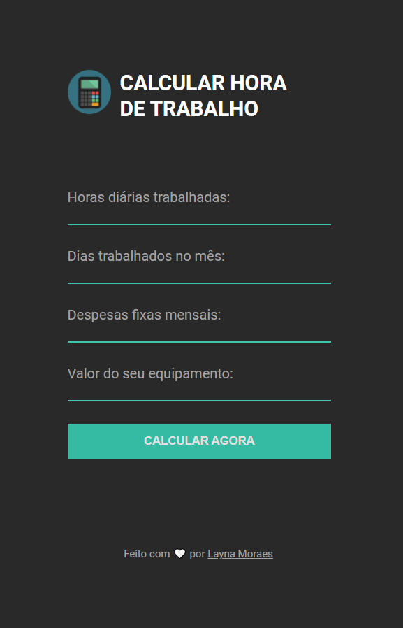
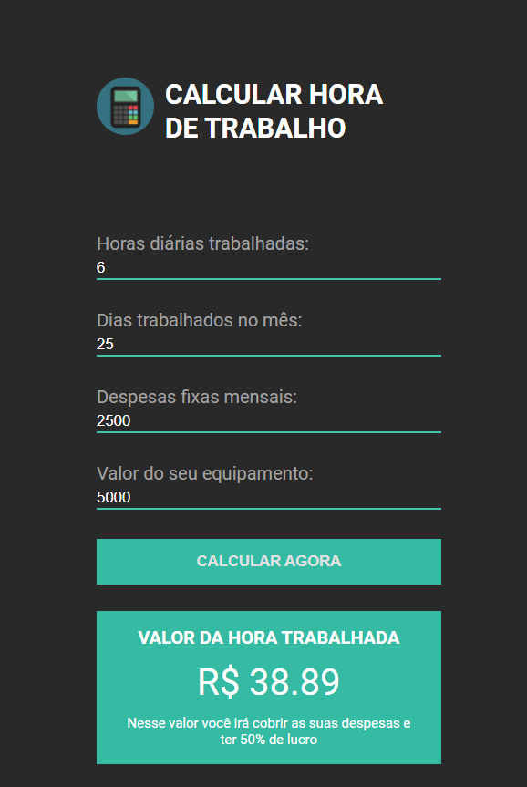

# Calculadora de Horas de Trabalho

## 📜 Sobre

O projeto é uma calculadora que nos retorna como resultado o valor da hora trabalhada. Foi desenvolvido durante o Webinar da EBAC.
  

## 🛠 Tecnologias utilizadas

- [HTML](https://developer.mozilla.org/pt-BR/docs/Web/HTML)
- [CSS](https://developer.mozilla.org/pt-BR/docs/Web/CSS)
- [JavaScript](https://developer.mozilla.org/pt-BR/docs/Web/JavaScript)
- [Git](https://git-scm.com/)
  

## ▶ Rodar o projeto

- Primeiro passo, clone o projeto em sua maquina
- Abra a pasta do projeto no terminal
- Instale as dependências com o comando `npm i` 
- Inicie o servidor com o comando `npm start` , uma nova aba ira se abrir no navegador, caso não ocorra
- Abre uma aba no navegar e navegue para localhost:3000
  

## ⌨ Resultado

GitHub Pages: [Link]()

 

